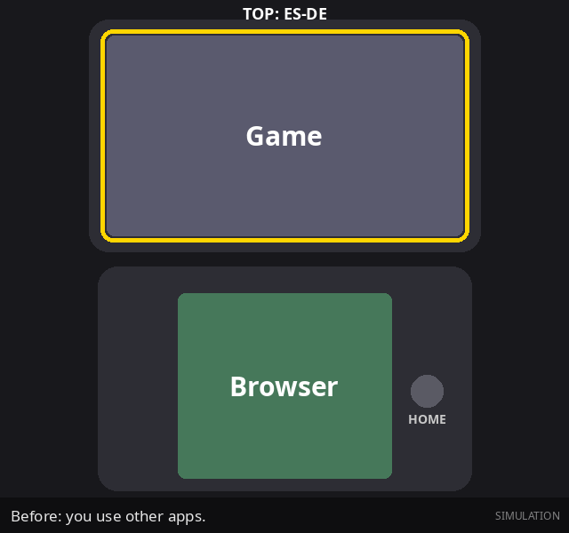

# Mjolnir

Mjolnir is a Home button router for dual-screen Android devices. The primary target is the AYN Thor.
You select one app for the top screen and one app for the bottom screen.
Then you set what each Home button gesture does.

This repository is a fork of [blacksheepmvp/mjolnir](https://github.com/blacksheepmvp/mjolnir). It continues from upstream 0.2.7a.

[User Guide](docs/USER-GUIDE.md) | [FAQ](FAQ.md) | [Changelog](CHANGELOG.md) | [Releases](https://github.com/Etsum/mjolnir/releases)



---

## Quick start

> **WARNING:** This fork uses a different APK signature from upstream. Uninstall the upstream Mjolnir before you install this APK. Android deletes the Mjolnir settings when you uninstall.

1. On the Thor, open **Thor Settings > Controller Settings**. Set **Prevent press the Home button accidentally** to OFF.
2. Install two or more home apps or frontends (for example ES-DE and a launcher).
3. Download the APK from [Releases](https://github.com/Etsum/mjolnir/releases). Install it.
4. Open Mjolnir. Select **Advanced** mode.
5. Give the Notification and Accessibility permissions.
6. Select your Top app and your Bottom app.
7. Select a gesture preset, or make a new preset.

For all steps and settings, read the [User Guide](docs/USER-GUIDE.md).

---

## Home actions

| Action | Icon | What it does |
|---|---|---|
| TOP: \<Top app\> | App icon | Opens your Top app on the top screen. |
| BOTTOM: \<Bottom app\> | App icon | Opens your Bottom app on the bottom screen. |
| BOTH: Auto | **Mjolnir icon** | Opens your Top app on the top screen and your Bottom app on the bottom screen. The Main Screen gets the focus. |
| FOCUS: Auto | Focus frame | Opens the Top app or the Bottom app, for the screen that has the focus. |
| FOCUS: \<Top app\> | App icon | Opens your Top app on the screen that has the focus. |
| TOP: Home | House | Opens your default home app on the top screen. |
| BOTTOM: Home | House | Opens your default home app on the bottom screen. |
| BOTH: Home | House | Sends the two screens to your default home app. |
| FOCUS: Home | House | Does the normal Android Home action. On the Thor, this can change the two screens. |
| TOP: Recent Tasks | Cards | Opens Recent Tasks. |
| \<DO NOTHING\> | X | Does nothing. |

The app also shows these descriptions in the gesture picker.
For the default home app rules and the focus rules, read [User Guide sections 7 and 8](docs/USER-GUIDE.md#7-input-focus).

---

## What is new in 0.3.0

* **No more "You should not be here." after a game closes** (upstream #31). SafetyNet opens the app of that screen again.
* **Start on boot waits for the SD card** (upstream #29).
* **Hide from Recents** switch for each app (upstream PR #40). Default OFF.

0.2.7b: TOP: Home and BOTTOM: Home change one screen only, the Main Screen gets the focus again, and presets keep their names.

Full list: [CHANGELOG.md](CHANGELOG.md).

---

## Safety

Mjolnir has protections against configurations that can lock a screen ("soft-lock").
Read [User Guide section 11](docs/USER-GUIDE.md#11-safety-and-recovery).
Configuration files are in `/Android/data/xyz.blacksheep.mjolnir/`.

---

## Steam File Generator

Mjolnir also contains a tool that makes `.steam` files for frontends such as ES-DE and Beacon.
Share a SteamDB link to Mjolnir to make a file.

---

## Build

Requirements: JDK 17 and the Android SDK (platform 34).

```sh
./gradlew assembleDebug          # debug APK
./gradlew testDebugUnitTest      # unit tests (Robolectric)
```

Regenerate the documentation images:

```sh
./gradlew testDebugUnitTest --tests '*DocScreenshots*' -Proborazzi.test.record=true   # app screenshots
python3 docs/tools/make_gifs.py                                                          # simulations (needs Pillow)
```

A release build reads its signing key from `keystore.properties` (not in Git). Without that file, the release APK is not signed.

---

## Credits

Original app by [blacksheepmvp](https://github.com/blacksheepmvp/mjolnir). Support the original developer: [ko-fi.com/xyzblacksheep](https://ko-fi.com/xyzblacksheep).
