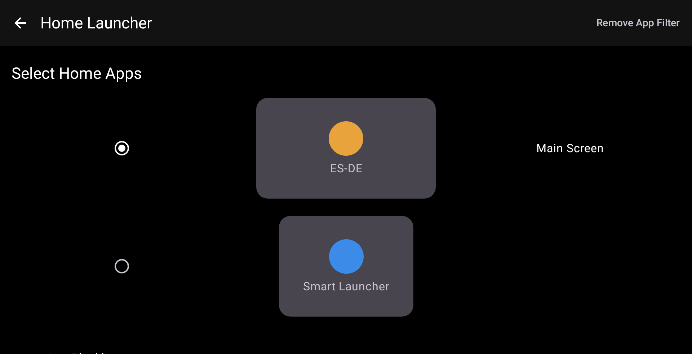
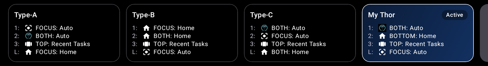
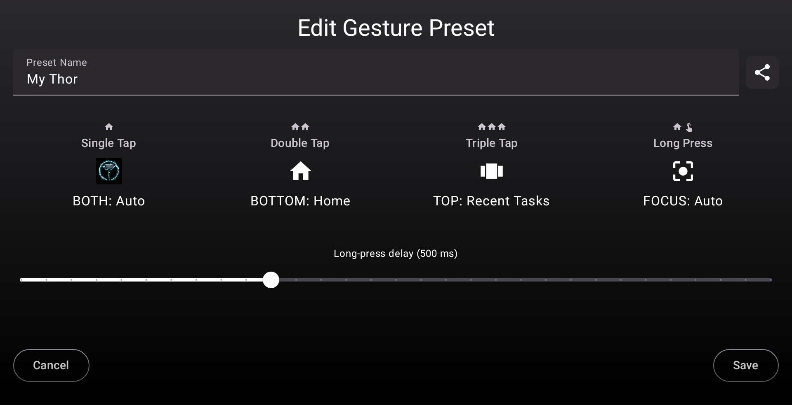
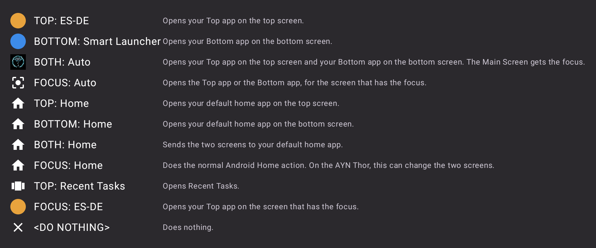
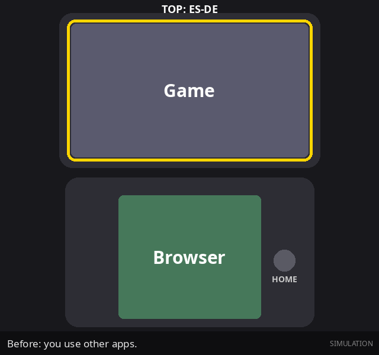
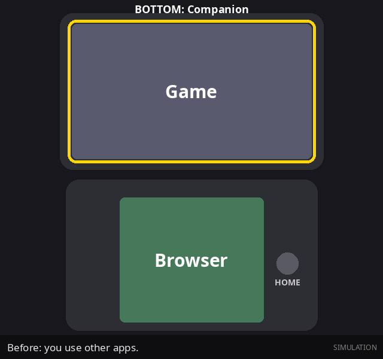
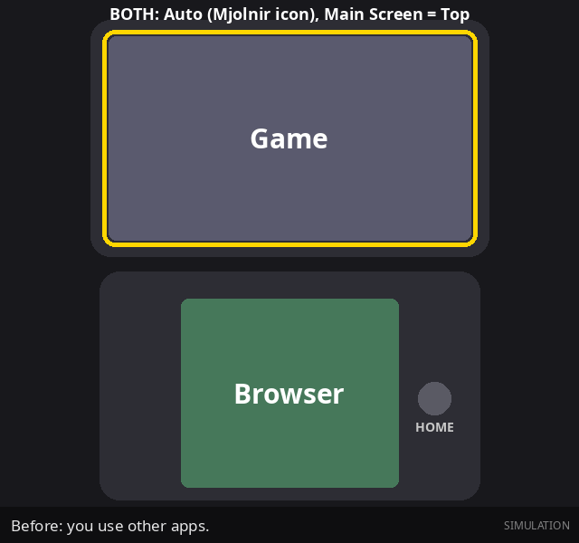
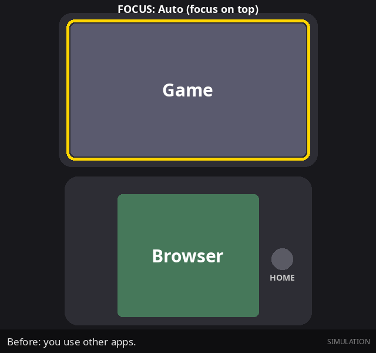
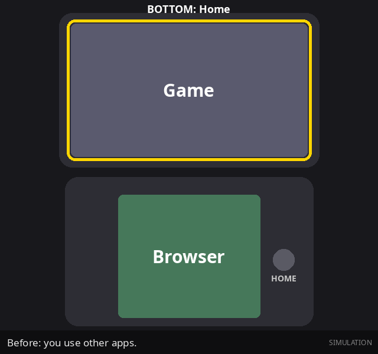
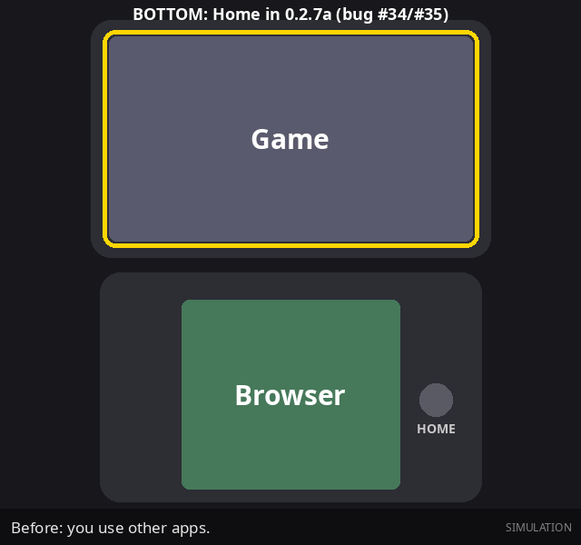

# Mjolnir User Guide (0.2.7b)

This guide uses ASD-STE100 Simplified Technical English.
The guide applies to the AYN Thor. Other dual-screen devices can operate differently.

The screenshots come from the 0.2.7b app. The animations are simulations.
In the animations, a yellow frame shows the screen that has the input focus.

## Contents

1. [Terms](#1-terms)
2. [Before you start](#2-before-you-start)
3. [Install Mjolnir](#3-install-mjolnir)
4. [Select the Top app and the Bottom app](#4-select-the-top-app-and-the-bottom-app)
5. [Set the Home button gestures](#5-set-the-home-button-gestures)
6. [Home actions](#6-home-actions)
7. [Input focus](#7-input-focus)
8. [Default home app](#8-default-home-app)
9. [Other settings](#9-other-settings)
10. [Example setups](#10-example-setups)
11. [Safety and recovery](#11-safety-and-recovery)
12. [Troubleshooting](#12-troubleshooting)

---

## 1. Terms

| Term | Meaning |
|---|---|
| Top screen | The large screen (display 0). |
| Bottom screen | The small screen (display 1). |
| Top app | The app that you select for the top screen. |
| Bottom app | The app that you select for the bottom screen. |
| Default home app | The app that Android opens when you push Home. You set it in Android Settings. |
| Main Screen | The screen that gets the input focus after Mjolnir opens apps on the two screens. |
| Input focus | The screen that gets the controller input. Only one screen has the focus. |
| Gesture | A pattern of Home button pushes: single, double, triple, or long. |
| Action | The operation that Mjolnir does for a gesture. |
| Preset | A file that keeps one action for each gesture. |

---

## 2. Before you start

### 2.1 Install other apps first

Mjolnir does not show apps. Mjolnir opens other apps.
Install at least two home apps or frontends before you start.
Examples: ES-DE, Daijisho, Beacon, Cocoon, Nova Launcher, Smart Launcher.

### 2.2 Set the AYN Thor settings

> **CAUTION:** If "Prevent press the Home button accidentally" is ON, the Thor can block Home pushes in apps that are not launchers. Then Mjolnir does not receive all the pushes, and the gestures do not operate correctly.

1. Open **Thor Settings**.
2. Open **Controller Settings**.
3. Set **Prevent press the Home button accidentally** to OFF.

| Thor setting | Recommended value | Reason |
|---|---|---|
| Prevent press the Home button accidentally | **OFF** | Mjolnir must receive each Home push. (Upstream issue #25.) |
| Enable Home and Back focus lock | Your choice | Mjolnir operates with ON and with OFF. |
| Focus Lock = Top Only | Your choice | If the controller stops on the top screen, set **Fix Focus-Lock Top input bug** to ON. Refer to [9.6](#96-fix-focus-lock-top-input-bug-experimental). |

---

## 3. Install Mjolnir

> **WARNING:** This APK has a different signature from the upstream (blacksheepmvp) APK. Android cannot update one with the other. You must uninstall the upstream app first. When you uninstall, Android deletes the Mjolnir settings and presets.

1. If you have custom presets, copy the folder `/Android/data/xyz.blacksheep.mjolnir/gestures/` to a safe location.
2. Uninstall the old Mjolnir app.
3. Download `Mjolnir-v0.2.7b.apk` from the Releases page.
4. Install the APK.
5. Open Mjolnir.
6. Follow the onboarding steps.
7. If you copied presets in step 1, put the `.cfg` files back in the `gestures` folder.

### 3.1 Basic mode and Advanced mode

Onboarding asks you to select a mode.

| | Basic mode | Advanced mode |
|---|---|---|
| Home button gestures | No | Yes |
| Permissions | None | Notification and Accessibility |
| Default home app | Mjolnir | Any launcher (Quickstep if a slot is `<Nothing>`) |
| Top app and Bottom app | Both are necessary | One can be `<Nothing>` |
| Start on boot | Yes, Mjolnir is the default home app | Optional |

Use Advanced mode for the gestures in this guide.

---

## 4. Select the Top app and the Bottom app

1. Open Mjolnir.
2. Open **Settings > Home Launcher**.
3. Select the card for the top screen. Select your Top app.
4. Select the card for the bottom screen. Select your Bottom app.
5. Select the radio button next to the screen that must have the focus. This screen is the **Main Screen**.

* The large card is the top screen. The small card is the bottom screen.
* The "Main Screen" label shows the screen that gets the focus.
* **Remove App Filter** shows all apps, not only launchers.
* In onboarding, if you select the app of the other screen, Mjolnir swaps the two apps.
* Mjolnir cannot select itself. This prevents a loop.

---

## 5. Set the Home button gestures

Mjolnir uses four gestures:

| Gesture | Label in the app | What you do |
|---|---|---|
| Single | Single Tap (1) | Push Home one time. |
| Double | Double Tap (2) | Push Home two times quickly. |
| Triple | Triple Tap (3) | Push Home three times quickly. |
| Long | Long Press (L) | Push and hold Home. |

### 5.1 Select a preset

A preset keeps one action for each gesture.
Mjolnir has three built-in presets: Type-A, Type-B, and Type-C.

1. Open **Settings > Home Launcher**.
2. Go to **Gesture Presets**.
3. Select a card. The card shows **Active**.

Hold a card to see more options: Edit, Copy, Share, Rename, and Delete.
You cannot rename or delete a built-in preset.

### 5.2 Make a new preset

1. Select the **+** card at the end of the row.
2. Type a name in **Preset Name**.
3. Select an action for each gesture. Refer to [6. Home actions](#6-home-actions).
4. Select **Save**.

* Mjolnir keeps the preset as `<name>.cfg` in `/Android/data/xyz.blacksheep.mjolnir/gestures/`.
* If you select **Cancel** or push Back, Mjolnir does not make a file.
* If you edit a built-in preset and type a new name, Mjolnir saves a new preset. The built-in preset does not change.
* If you edit a built-in preset and keep its name, Mjolnir changes the built-in preset.

### 5.3 Change the gesture speed

* **Long-press delay** (in the preset editor): the time that you must hold Home for a Long gesture.
* **Use system double-tap delay** (in Home Launcher settings): the maximum time between pushes for Double and Triple.
* **Custom double-tap delay**: use this value if the system delay is too short or too long.

---

## 6. Home actions

Each action has an icon. The icon shows in the preset cards and in the action list.

### 6.1 Icons

| Icon | Meaning |
|---|---|
| Icon of an app | The action opens that app (your Top app or your Bottom app). |
| **Mjolnir icon** (hammer) | **BOTH: Auto.** Mjolnir opens your Top app and your Bottom app together. |
| House | The action uses the default home app (TOP/BOTTOM/BOTH/FOCUS: Home). |
| Focus frame | **FOCUS: Auto.** The action uses the screen that has the focus. |
| Cards | **TOP: Recent Tasks.** |
| X | **\<DO NOTHING\>.** |

### 6.2 Action reference

Labels show your app names. In this guide, the Top app is ES-DE and the Bottom app is Companion.

| Action | Top screen | Bottom screen | Focus after |
|---|---|---|---|
| **TOP: \<Top app\>** | Top app | No change | Top |
| **BOTTOM: \<Bottom app\>** | No change | Bottom app | Bottom |
| **BOTH: Auto** | Top app | Bottom app | Main Screen |
| **FOCUS: Auto** | Top app, if the top screen has the focus | Bottom app, if the bottom screen has the focus | No change |
| **FOCUS: \<Top app\>** | Top app, if the top screen has the focus | Top app, if the bottom screen has the focus | No change |
| **TOP: Home** | Default home app | No change | Top |
| **BOTTOM: Home** | No change | Default home app | Bottom |
| **BOTH: Home** | Default home app | Default home app | Main Screen |
| **FOCUS: Home** | Normal Android Home | Normal Android Home | Device |
| **TOP: Recent Tasks** | Recent tasks | No change | Top |
| **\<DO NOTHING\>** | No change | No change | No change |

Notes:

* "Auto" actions use your Top app and your Bottom app.
* "Home" actions use your default home app. Refer to [8. Default home app](#8-default-home-app).
* FOCUS: Home does the same as the Home button without Mjolnir. On the AYN Thor, this usually sends the two screens home.
* If a slot is `<Nothing>`, the Auto actions use **Empty slot behavior**. Refer to [9.2](#92-empty-slot-behavior-auto-actions).

### 6.3 Animations

Setup for all animations: Top app = ES-DE. Bottom app = Companion. Default home app = Launcher.
Before each Home push, the top screen shows a game and the bottom screen shows a browser.

| Action | Result |
|---|---|
| TOP: ES-DE |  |
| BOTTOM: Companion |  |
| BOTH: Auto, Main Screen = Top |  |
| BOTH: Auto, Main Screen = Bottom |  |
| FOCUS: Auto (focus on top) |  |
| TOP: Home |  |
| BOTTOM: Home |  |
| BOTH: Home |  |
| BOTTOM: Home in 0.2.7a (old bug) |  |

All actions in one animation: [sim-tour.gif](images/sim-tour.gif).

---

## 7. Input focus

Only one screen gets the controller input. This screen has the **input focus**.

### 7.1 How Mjolnir sets the focus

* When Mjolnir opens apps on the two screens, it opens the **Main Screen app last**. The app that opens last gets the focus.
* When Mjolnir opens an app on one screen, that screen gets the focus.
* FOCUS actions do not change the focus. They use the screen that has the focus now.

### 7.2 Give the focus to one app (upstream issue #38)

Example: ES-DE is on the top screen. ES-DE Companion is on the bottom screen. ES-DE must get the controller input.

1. Open **Settings > Home Launcher**.
2. Select the radio button next to the **top** card. The top screen is now the Main Screen.
3. Set your Single gesture to **BOTH: Auto**.
4. Push Home one time.

Result: Mjolnir opens Companion on the bottom screen first. Then it opens ES-DE on the top screen. ES-DE has the focus.

> **NOTE:** In 0.2.7a, BOTH: Auto opened the Main Screen app first. Thus the other app got the focus. 0.2.7b corrects this.

### 7.3 Focus and FOCUS actions

FOCUS actions use the screen that has the focus when you push Home.
Touch a screen to give it the focus. Then push Home.

### 7.4 What Mjolnir cannot do

* Mjolnir cannot set a different focus for each gesture. The Main Screen setting applies to all BOTH actions.
* Mjolnir cannot move the focus without opening an app.

If you need a different focus for each gesture, tell the developer. This is a possible feature.

---

## 8. Default home app

The "Home" actions (TOP: Home, BOTTOM: Home, BOTH: Home) use your **default home app**.
Set the default home app in Android: **Settings > Apps > Default apps > Home app**.
In Mjolnir: **Settings > Home Launcher > Set default home**.

### 8.1 What TOP: Home and BOTTOM: Home do

| Default home app | TOP: Home / BOTTOM: Home |
|---|---|
| A normal launcher (for example Nova Launcher, Smart Launcher, ES-DE) | Opens the launcher on that screen only. |
| The same app as the **other** slot | Uses the normal Android Home. On the Thor, both screens can change. |
| Quickstep (AYN default) or Odin Launcher | Uses the normal Android Home. On the Thor, both screens can change. |
| Mjolnir | Uses the normal Android Home. |
| No default selected | Uses the normal Android Home. |

Mjolnir does not open Quickstep, Odin Launcher, or itself on one screen. These apps cause loops or errors on the bottom screen.

### 8.2 BOTH: Home

BOTH: Home always uses the normal Android Home on each screen. One launcher cannot show on the two screens at the same time.

### 8.3 Quickstep and `<Nothing>`

> **CAUTION:** If one slot is `<Nothing>`, you must set **Quickstep** as the default home app. Onboarding tells you to do this. If you do not, a screen can stay empty.

---

## 9. Other settings

All settings are in **Settings > Home Launcher**.

### 9.1 Start on boot (Advanced only)

* ON (**BOTH: Auto**): after a restart, Mjolnir opens your Top app and your Bottom app.
* OFF (**BOTH: Home**): after a restart, Mjolnir sends the two screens to the default home app.

### 9.2 Empty slot behavior (Auto actions)

This setting applies when a slot is `<Nothing>`.

* **Launches Home** (ON, default): the empty screen shows the default home app.
* **Does nothing** (OFF): the empty screen does not change.

### 9.3 Top/bottom launch delay

The time between the two app launches of a BOTH action (0 to 500 ms).
Increase the delay if one app does not open, or if the focus goes to the wrong screen.

### 9.4 Double-tap delay

Refer to [5.3](#53-change-the-gesture-speed).

### 9.5 App Blacklist

Hides apps from the app picker. Mjolnir is always hidden.

### 9.6 Fix Focus-Lock Top input bug (experimental)

The AYN Thor "Focus Lock: Top Only" setting has a firmware bug. The controller can stop on the top screen.
This setting shows an invisible overlay for a short time to reset the focus.
It needs the "Display over other apps" permission.

> **NOTE:** Upstream recommends this setting if a slot is `<Nothing>`.

### 9.7 Diagnostics

Records logs in `/Android/data/xyz.blacksheep.mjolnir/logs/`. Use **View / Export Diagnostics** to share logs with a bug report.

---

## 10. Example setups

### 10.1 Frontend on top, launcher on bottom

| Item | Value |
|---|---|
| Top app | ES-DE |
| Bottom app | Smart Launcher |
| Default home app | Nova Launcher (any normal launcher that is not your Top app or Bottom app) |
| Main Screen | Top |
| Single | BOTH: Auto |
| Double | FOCUS: Auto |
| Triple | TOP: Recent Tasks |
| Long | BOTTOM: Home |

### 10.2 ES-DE with ES-DE Companion

| Item | Value |
|---|---|
| Top app | ES-DE |
| Bottom app | ES-DE Companion |
| Main Screen | Top (ES-DE gets the controller) |
| Single | BOTH: Auto |
| Double | BOTTOM: ES-DE Companion |
| Long | TOP: Recent Tasks |

### 10.3 One screen only

| Item | Value |
|---|---|
| Top app | Your frontend |
| Bottom app | `<Nothing>` |
| Default home app | **Quickstep** (necessary) |
| Fix Focus-Lock Top input bug | ON |

---

## 11. Safety and recovery

### 11.1 SafetyNet

Mjolnir keeps a small, empty activity at the bottom of each screen. If an app closes and nothing is below it, you see this activity. It prevents a black screen that you cannot use.
If you see the SafetyNet screen, push Home or open Mjolnir.

### 11.2 Configurations that Mjolnir prevents

| Configuration | What Mjolnir does |
|---|---|
| Basic mode with one slot set and one slot `<Nothing>` ("Bottomless Pit") | Mjolnir does not let you save it. At start-up, Mjolnir deletes it and starts onboarding. |
| Mjolnir as the Top app or Bottom app | Mjolnir hides itself from the app picker. |
| Advanced mode without permissions | Onboarding does not continue without Notification and Accessibility permissions. |
| A slot is `<Nothing>` and Quickstep is not the default home app | Onboarding tells you to set Quickstep. |
| Three app launch failures in sequence (Basic mode) | Mjolnir resets the configuration and starts onboarding. |
| TOP/BOTTOM: Home with Mjolnir, Quickstep, or Odin as the default home app | Mjolnir does not open them on one screen. It uses the normal Android Home. |

### 11.3 Reset the configuration

1. Open a file manager.
2. Go to `/Android/data/xyz.blacksheep.mjolnir/`.
3. Delete or edit one of these files:
   * `settings.json` (Top app, Bottom app, Main Screen, and other settings)
   * `config.ini` (internal values)
   * `blacklist.json` (hidden apps)
   * `gestures/*.cfg` (presets)
4. Restart Mjolnir. Mjolnir makes new default files.

---

## 12. Troubleshooting

| Problem | Possible cause | Correction |
|---|---|---|
| Each gesture sends the two screens home. | "Prevent press the Home button accidentally" is ON. | Set it to OFF. Refer to [2.2](#22-set-the-ayn-thor-settings). |
| TOP: Home or BOTTOM: Home changes the two screens. | Version 0.2.7a. | Install 0.2.7b. |
| TOP: Home or BOTTOM: Home changes the two screens (0.2.7b). | The default home app is Quickstep, Odin, Mjolnir, or the app on the other screen. | Set a different default home app. Refer to [8.1](#81-what-top-home-and-bottom-home-do). |
| The wrong app gets the controller after BOTH: Auto. | The Main Screen is not correct. | Set the Main Screen to the screen of the app that must get the controller. Refer to [7.2](#72-give-the-focus-to-one-app-upstream-issue-38). |
| The wrong app still gets the controller. | The second app opens too quickly. | Increase **Top/bottom launch delay**. |
| Single and double gestures mix. | The double-tap delay is too long or too short. | Change the double-tap delay. |
| Many `untitled-N.cfg` files. | Version 0.2.7a. | Install 0.2.7b. Delete the extra files in the `gestures` folder. |
| A new preset loses its name. | Version 0.2.7a. | Install 0.2.7b. |
| "Focus detection failed" message. | Mjolnir cannot find the screen with the focus. | Touch the screen. Push Home again. |
| The controller stops on the top screen. | AYN Focus Lock bug. | Set **Fix Focus-Lock Top input bug** to ON. |
| Nothing happens when you push Home. | The Accessibility permission is off. | Open Android **Settings > Accessibility**. Set Mjolnir to ON. |
